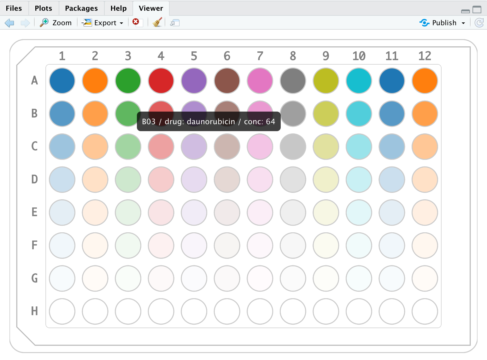

```{r setup, include=FALSE}
knitr::opts_chunk$set(echo = TRUE)
```

```{r, echo=FALSE}
suppressPackageStartupMessages(library(tidyverse))
library(mtpview)
mtp_example1
```

View your data in place interactively with `mtp_view()`.
```{r, eval=FALSE}
# mtp_example1 %>% mtp_view()
# mtp_example1 %>% mtp_view(fillVar = "drug")
mtp_example1 %>% mtp_view(fillVar = "drug", fillOpacityVar = "conc")
```



Or, use `mtp_ggplot()` which is best for saving and printing and plays nice with `ggplot2`.

```{r}
mtp_example1 %>% mtp_ggplot()
mtp_example1 %>% mtp_ggplot(well_fill_var = "drug")
mtp_example1 %>% mtp_ggplot(well_fill_var = "drug", well_alpha_var = "conc")
mtp_example1 %>% 
    mtp_ggplot(well_fill_var = "drug", well_alpha_var = "conc") + 
    guides(alpha = F)
```

You can also add lineplots to if you have repeated measures for each well:

```{r}
mtp_example2 %>% 
    mtp_ggplot(well_fill_var = "cond", well_alpha_var = "assay_conc_um", 
               draw_lineplots = T) + 
    guides(alpha = F)
```

Some info on how the input data should be structured. The measurements for each 
well are nested in data variable to maintain the each-row-is-a-well convention.

```{r}
mtp_example2
mtp_example2 %>% unnest(data)
```

