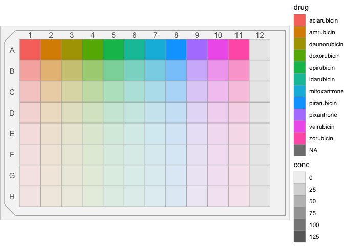
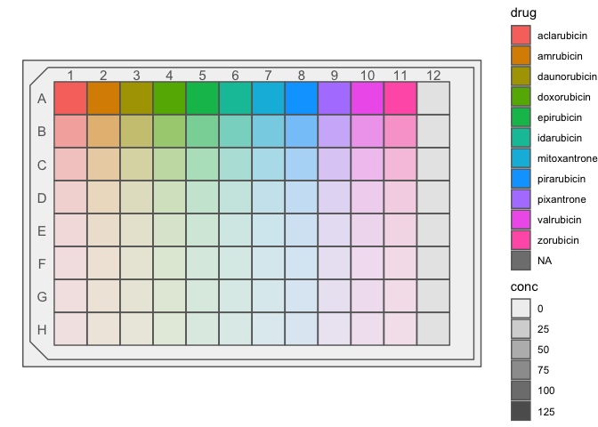
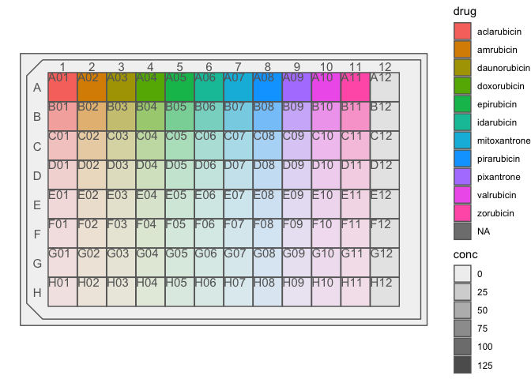
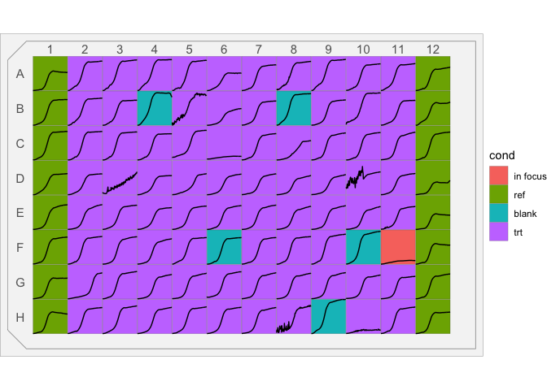

Easily view your microtitre plate data
================

    ## # A tibble: 96 x 3
    ##    well  drug          conc
    ##    <chr> <chr>        <dbl>
    ##  1 A01   aclarubicin    128
    ##  2 A02   amrubicin      128
    ##  3 A03   daunorubicin   128
    ##  4 A04   doxorubicin    128
    ##  5 A05   epirubicin     128
    ##  6 A06   idarubicin     128
    ##  7 A07   mitoxantrone   128
    ##  8 A08   pirarubicin    128
    ##  9 A09   pixantrone     128
    ## 10 A10   valrubicin     128
    ## # … with 86 more rows

View your data in place interactively with `mtp_view()`.

``` r
# mtp_example1 %>% mtp_view()
# mtp_example1 %>% mtp_view(fillVar = "drug")
mtp_example1 %>% mtp_view(fillVar = "drug", fillOpacityVar = "conc")
```


Or, use `mtp_ggplot()` which is best for saving and printing and plays
nice with
`ggplot2`.

``` r
mtp_example1 %>% mtp_ggplot()
```

<!-- -->

``` r
mtp_example1 %>% mtp_ggplot(well_fill_var = "drug")
```

<!-- -->

``` r
mtp_example1 %>% mtp_ggplot(well_fill_var = "drug", well_alpha_var = "conc")
```

<!-- -->

``` r
mtp_example1 %>% 
    mtp_ggplot(well_fill_var = "drug", well_alpha_var = "conc") + 
    guides(alpha = F)
```

<!-- -->

You can also add lineplots to if you have repeated measures for each
well:

``` r
mtp_example2 %>% 
    mtp_ggplot(well_fill_var = "cond", well_alpha_var = "assay_conc_um", 
               draw_lineplots = T) + 
    guides(alpha = F)
```

<!-- -->

Some info on how the input data should be structured. The measurements
for each well are nested in data variable to maintain the
each-row-is-a-well convention.

``` r
mtp_example2
```

    ## # A tibble: 96 x 5
    ##    well  drug_name            assay_conc_um data               cond 
    ##    <chr> <chr>                        <dbl> <list>             <fct>
    ##  1 A01   <NA>                            NA <tibble [111 × 2]> ref  
    ##  2 A02   Abacavir Sulfate               200 <tibble [111 × 2]> trt  
    ##  3 A03   Acamprosate                    200 <tibble [111 × 2]> trt  
    ##  4 A04   Acarbose                       200 <tibble [111 × 2]> trt  
    ##  5 A05   Acebutolol·HCl                 200 <tibble [111 × 2]> trt  
    ##  6 A06   Acetaminophen                  200 <tibble [111 × 2]> trt  
    ##  7 A07   Acetazolamide                  200 <tibble [111 × 2]> trt  
    ##  8 A08   Acetohexamide                  200 <tibble [111 × 2]> trt  
    ##  9 A09   Acetohydroxamic Acid           200 <tibble [111 × 2]> trt  
    ## 10 A10   Acetylcysteine                 200 <tibble [111 × 2]> trt  
    ## # … with 86 more rows

``` r
mtp_example2 %>% unnest(data)
```

    ## # A tibble: 10,656 x 6
    ##    well  drug_name assay_conc_um cond  runtime measure
    ##    <chr> <chr>             <dbl> <fct>   <dbl>   <dbl>
    ##  1 A01   <NA>                 NA ref         0   0.077
    ##  2 A01   <NA>                 NA ref      1033   0.078
    ##  3 A01   <NA>                 NA ref      2114   0.079
    ##  4 A01   <NA>                 NA ref      3195   0.08 
    ##  5 A01   <NA>                 NA ref      4276   0.081
    ##  6 A01   <NA>                 NA ref      5357   0.081
    ##  7 A01   <NA>                 NA ref      6438   0.082
    ##  8 A01   <NA>                 NA ref      7519   0.082
    ##  9 A01   <NA>                 NA ref      8600   0.083
    ## 10 A01   <NA>                 NA ref      9681   0.084
    ## # … with 10,646 more rows
